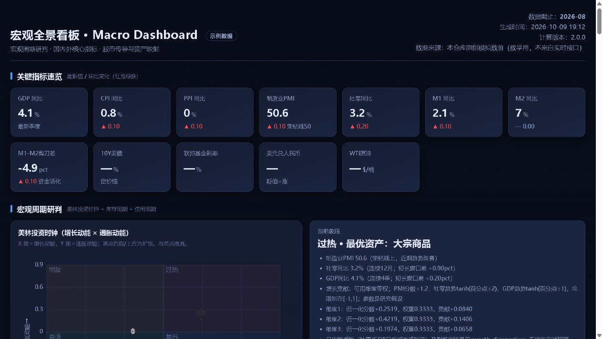

# 宏观研究看板

从公开渠道取得宏观序列，生成可离线打开的 HTML 看板，观察周期代理指标与行业历史关联。

## 结果预览与一分钟教学演示



截图为实际生成并检查的教学报告，保留模拟所属期、生成时间与计算版本。数值全部为原创模拟，海外、融资及行业缺项保留为空；周期观察不是已验证预测或因果归因。[样本与截图生成说明](assets/preview/README.md)。

Windows 在仓库根目录运行（Python 3.8+，标准库，无需联网或安装第三方 Python 包）：

```text
python scripts/demo_preview.py --out-dir local-data/public-demo
```

预期输出：打开 `local-data/public-demo/macro-demo.html`，查看指标、周期代理和缺口；同目录保存 `demo-input.json` 与 `cycle.json` 供复查。目录已存在时拒绝覆盖，请另选新目录。此新入口属于 PR #1 待审分支，主分支尚未包含。

看板支持指标、来源及状态筛选，日期图表窗口、已有贡献与尺度观察排序，以及带参数、方法版本和展示快照的新 JSON 留档。窗口不重算主指标或周期结论，没有在线刷新；详见[显示交互与留档](references/view_controls.md)及[实际交互截图](assets/preview/macro-controls.png)。

关键情景实例（原创教学，输出另选新目录）：

```text
python scripts/run_scenarios.py --out-dir local-data/scenarios
```

同目录`index.json`索引六个情景，各保存输入、手算预期、实际命令/结果与方法版本；成功情景生成HTML，失败情景检查旧结果不变。范围与已有测试复用见[情景索引](references/data_contract_inventory.md#2026-10-10-情景实例验收批)。不代表真实数据、因果预测或视觉验收。

## 其他运行入口

在仓库根目录运行。最低支持目标为 Python 3.8，脚本使用标准库；实际运行验收为 Python 3.12.10，未逐版本验收。Windows 使用 python，如仅配置了 Python 启动器可换成 py -3；其他系统可按环境换成 python3。ECharts 随源码内置，无需安装 Python 第三方包。

教学演示，无需联网，不代表真实经济数据：

```text
python scripts/run_pipeline.py --demo --workdir local-data/demo
```

程序打印新建运行目录下的 HTML 路径，用浏览器打开即可。重复运行另建目录。

默认演示使用原创模拟数值，未模拟的海外、融资与行业模块留空。旧第三方快照仅保留[显式本地复现入口](assets/SAMPLE_DATA_RIGHTS.md)，不随源码归档，不属于项目 MIT 数据授权。

真实数据完整流水线，需要联网；有缺口时只能生成部分看板：

```text
python scripts/run_pipeline.py --workdir local-data/research
```

指定输出文件的示例：

```text
python scripts/run_pipeline.py --demo --out local-data/demo.html --workdir local-data/demo
```

指定文件已存在则拒绝；显式增加 --overwrite 仅在本次成功后替换，失败保留旧文件。正式模式不自动使用样本；全部无有效输入时失败。

已有真实归档可直接组装，路径按实际文件替换，指定新输出文件：

```text
python scripts/build_dashboard.py --eastmoney local-data/em.json --fred local-data/fr.json --out local-data/from-archive.html
```

也可传入 --cycle、--longcycle、--attribution、--credit，对应生成入口为 compute_cycle.py、compute_long_cycle.py、regress_attribution.py、fetch_credit.py。用 python scripts/<脚本名>.py --help 查看参数。直接入口与流水线的覆盖保护不同，请使用新文件路径。

## 已实现能力与边界

- 国内 GDP、CPI、PPI、PMI、社零、货币与房价；海外利率、就业、汇率、大宗及长周期序列。源码配置为 9 项国内指标、27 条 FRED 原始序列及 2 条派生序列，不保证每次全数取得。
- 周期看板包含增长、通胀及多种代理观察；库存用 PPI/PMI，信用用 M1−M2，估值环境用利率分位，不能转述为真实库存、贷款需求或股票估值。
- 信用模块（待审）自动取数覆盖 9 条序列：LPR、人民币新增贷款、社融及部分融资分项、美国银行标准与需求调查；缺口单列，国内与美国分别观察，见[信用传导说明](references/credit_transmission.md)。
- 行业回归描述历史关联，不能证明因果或预测收益。长周期滤波属于事后研究，康波与熊彼特属于定性框架；政策窗口惯例不代替实际公告。

## 输入与关键口径

输入为取数脚本生成的 JSON 或同构用户数据；CSV、Excel 需先转换，本包没有通用文件导入器。见[指标字典](references/indicators.md)。

日期和值必须一一对应、升序且不重复；月、季、日、周频按各自规则处理。缺期不插值，趋势至少 4 个连续有效观测。日频仅容许周末间隔，未接官方交易日历，节假日会保守缩短窗口。

周期计算 2.1.0 将 PMI、社零和 GDP 的增长评分统一到有界尺度，公开贡献与敏感性，参数属于研究假设；通胀维度保留自身单位及权重，不与增长分值比较绝对大小。2.1.0 同比改用上年同月/同季，拒绝频率冲突与非法季度；信用剪刀差默认保留原值，显式屏蔽披露假设。详见[方法卡](references/macro_method_cards.md)、[周期规则](references/cycle_framework.md)及[版本契约](references/macro_contract.md)。

百分数以数值直接记录，例如 0.8 表示 0.8%；百分点差不等于百分比变化。中美利差为中国 3 个月银行间利率减美国联邦基金利率，不是同期限国债利差。CPIAUCSL 为季调指数，计算同比不冒充通常公布的未季调同比。

## 输出、来源与缺失状态

HTML 内联图表库，可离线打开；输入和中间 JSON 保存在本次独立运行目录。流水线子任务先暂存，成功且非空后保存。部分数据标为不完整；未知值留空，不填零、不用样本或其他地区数据补缺。

渠道包括东方财富、FRED、新浪行业行情及商务部转载社融。渠道与原始生产机构分开登记，见[来源表](references/source_catalog.json)和[研究路由](references/research_routing.md)。既往成功不保证接口持续可用。源码保留已使用的请求头策略，不把一次经验写成永久服务规则。

网页证据表区分取得数据与原文核验，保留观测期、获取时间及已取得的发布/修订记录。观测期不等于发布日期；缺首次发布或历史修订版本时，不声称数据在当时已知。计划来源不表示已接入。

## 验证范围

```text
python -m unittest discover -s tests -v
python scripts/check_repository.py --archive
node tests/test_dashboard_controls.js
```

2026-10-09：32 项测试通过，覆盖缺月、空值、日期错位、评分贡献、安全保存与同版本转换。此前真实归档重建成功，5 个行业、33 个月回归的因子和行业数值保持一致。教学演示通过不代表联网取数通过；此次未重新获取全部网络数据、逐项核验官方原文或完成跨包等价验收。

2026-10-10 独立验收：待审源码归档在新目录、新venv和隔离用户目录完成最短教学流程及模块来源/失败例检查；属于现有宿主上的进程隔离，未验证自然语言Skill发现或浏览器视觉。详见[独立验收记录](references/data_contract_inventory.md#2026-10-10-独立安装使用验收批已结案)。

2026-10-10 有界后续：34项测试通过，新增候选旁挂正常/缺基期、未知时点、单位冲突与未知接口版本反例；没有新增真实取数、跨仓联调或视觉验收。

Node 仅用于上述开发/CI 检查，生成和浏览看板不需要安装 Node。

PR 新增 GitHub Actions 自动检查，覆盖 Windows/Linux、Python 3.8/3.12 的离线测试、文档和源码归档演示。运行结果以 PR 的检查记录为准；不把离线 CI 当作数据渠道可用性或经济判断验收。

## 版本与发布状态

更新日期：2026-10-10。仓库尚无 Git 标签或 GitHub Release，不提供已发布安装包。

| 范围 | 状态 |
|---|---|
| main | 已入主分支：国内及海外取数、周期看板、行业回归；Skill 元数据为 1.4.0。旧分支仍有自动样本兜底及日期处理问题 |
| [PR #1](https://github.com/KILING-TASI/macro-dashboard-engine/pull/1) | 待审，未合并：数据质量、显式演示、信用传导、证据表、日期连续性及安全保存 |
| PR 的版本标识 | Skill 1.6.3；周期计算 2.1.0；有限观测接口 1.0.0。这是不同组件版本，不是已发布产品版本 |

下面示例对应 PR 分支 fix/macro-data-quality。主分支不保证支持新增参数。

数据入口、职责上下游、分层交付状态及各类版本支持范围统一见[数据目录与契约差异](references/data_contract_inventory.md)。本次候选旁挂只适配已有1.0.0接口的原创模拟；跨仓同样本联调未完成，不代表九仓统一。

## 后续路线与相关仓库

版本历史见[变更记录](CHANGELOG.md)，已有与后续范围见[路线](ROADMAP.md)。主分支新增的[设计方案 v1.4](docs/设计方案.md)完整保留，记录当时的设计与验证；其中自动兜底、旧评分和路径示例属于历史版本，当前执行规则以本文和版本契约为准。

本包保持独立。可选[宏观接口 1.0.0](references/macro_contract.md)输出有限观测和周期观察，工作台保留研究解释；无强制跨包依赖，尚未替代 research-workbench 的官方发布核验、资产窗口或原始响应复解析。相关仓库不因名称相关而自动视为等价组件。

## 许可与第三方数据

项目原创代码及有权授权的原创说明采用标准 [MIT](LICENSE)，版权标注 KILING-TASI，并保留已有 contributors 声明。内置 ECharts、D3 和其他声明保留原许可；字体、截图、外部数据及未明权利分界见[许可范围清单](LICENSE_SCOPE.md)和[第三方说明](THIRD_PARTY_NOTICES.md)。仓库许可不表示获得第三方数据或原文附件的再分发授权。

本仓库以源码分发，尚无专用安装包；源码归档需包含 README、许可声明、Skill、脚本、模板、图表库和方法资源，不附个人研究缓存。

看板用于研究与历史观察，代理评分和经验映射不构成收益保证或投资指令。使用前请阅读主分支新增的[免责声明与使用边界](DISCLAIMER.md)，结合数据来源、假设与缺口独立判断。代码许可不包含第三方数据授权。
